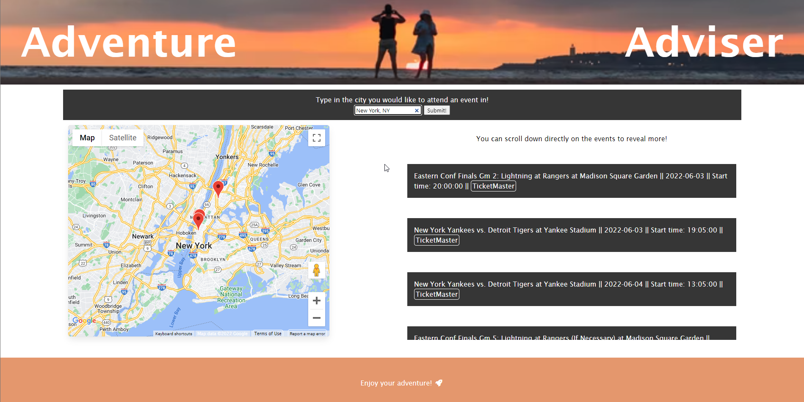
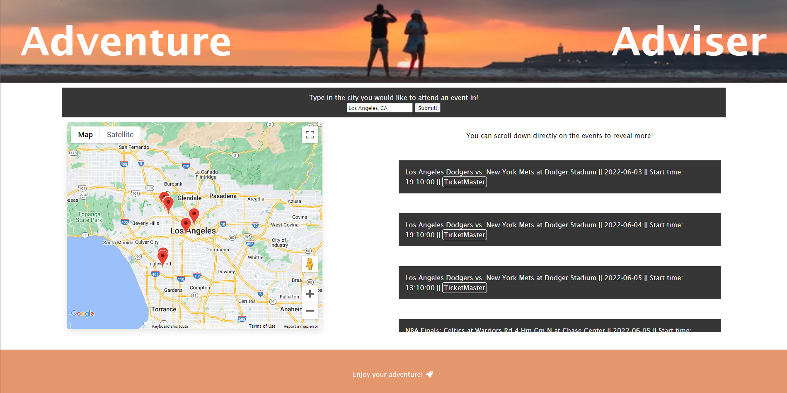
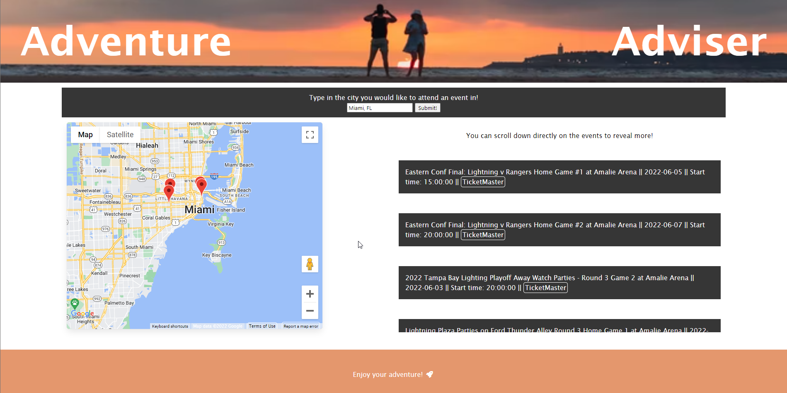
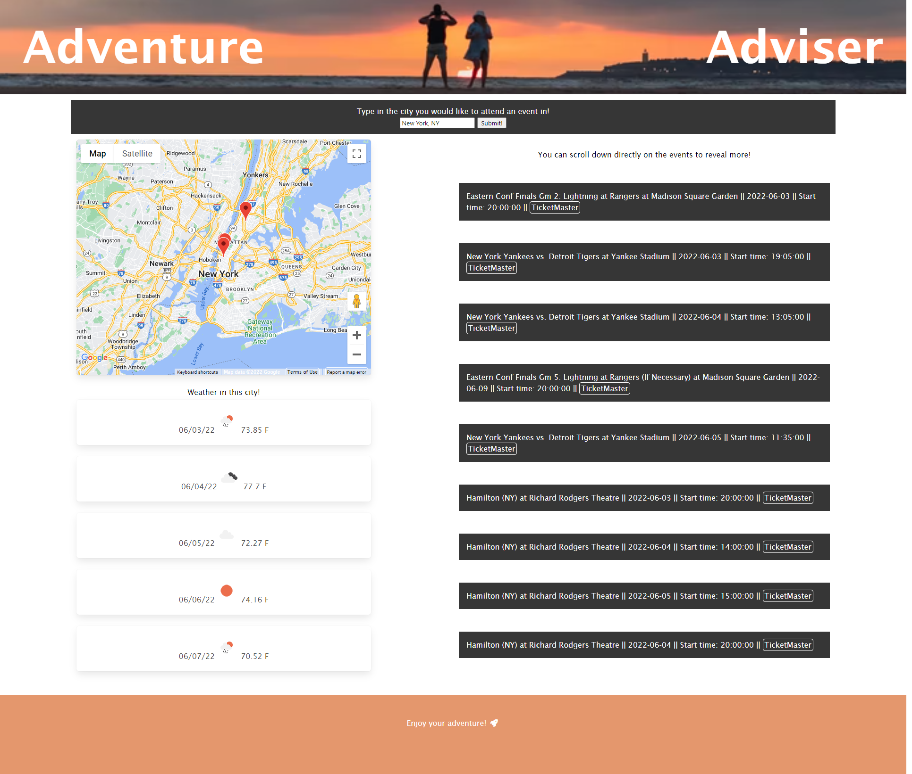

<!-- # Adventure Advisor

We decided to make a functional and interactable website that makes finding events near the user easier and more convenient. Whether the events are concerts, sporting events or any other type of events, this website locates the event with precise location, time and date. The precise location of the event(s) are located on the map, while the time, date and arena are on the information bars. Additionally, next to the events are clickable buttons that direct the user to TicketMaster to purchase the tickets. 

## Developers

- [@Jack](https://www.github.com/jcdoran33)
- [@Alyssa](https://www.github.com/AlyLopez02)
- [@Gregory](https://www.github.com/Gregm316)
- [@David](https://www.github.com/HerediaDavid)

## Technology Used
- Font Awesome
- Bulma.io
- jQuery
- Moment.js
- Google Maps Javascript API
- Google Maps Geocoding API
- TicketMaster API
- OpenWeather One Call API

## Examples



- This image shows what appears when looking for events in New York, NY.



- This image shows what appears when looking for events in Los Angeles, LA.



- This image shows what appears when looking for events in Miami, FL.

## Deployment

To deploy this project run

```bash
 https://jcdoran33.github.io/Adventure-Adviser/ -->
<!-- ``` -->


# Adventure Adviser
## Description:
The files found with this README file come together to create a functional and interactive website that makes finding events near the user easier and more convenient. This application was created from scratch. 

### Application Summary
With this application, a user can input a city from anywhere in the world and gain information about events going on in the city as well as local weather. The information regarding the events includes their name, location (on a mini map with markers), date, time, and a link to purchase the tickets to said events. The local weather includes a five day forecast.


## HTML
In the HTML file, we set up multiple features. We:
- Created a header and footer that were on brand for the application
- Created a search form for user input
- Input a map, weather list, and event list

## CSS
We used Bulma.io for the majority of the CSS formatting. This enabled us to create an aesthically pleasing and responsive website with a polished UI. 

In the CSS file, we did minimal changes to keep the application's appearance on brand. Additionally, we also managed display properties to make the application look more professional by not displaying empty div containers.


## Javascript
In the Javascript file, we did multiple things. We:
- Created functions that took the user's input and use the Google Maps Geocode API to get the latitude and longitude from said input. 
- Passed the latitude and longitude to the TicketMaster Discovery API and display the events returned via a list
- Used the Google Maps Javascript API to create a mini map and used a function to create markers on said map of each event listed prior
- Displayed a five day weather forecast for the location

## Technology Used
- Font Awesome
- Bulma.io
- jQuery
- Moment.js
- Google Maps Javascript API
- Google Maps Geocoding API
- TicketMaster API
- OpenWeather One Call API

## Screenshot:
Here is a screenshot of the deployed application for events in New York, NY:



## Link to deployed application:

Here is the link to the deployed application via GitHub:

<a href="https://jcdoran33.github.io/Adventure-Adviser/">https://jcdoran33.github.io/Adventure-Adviser/</a>

